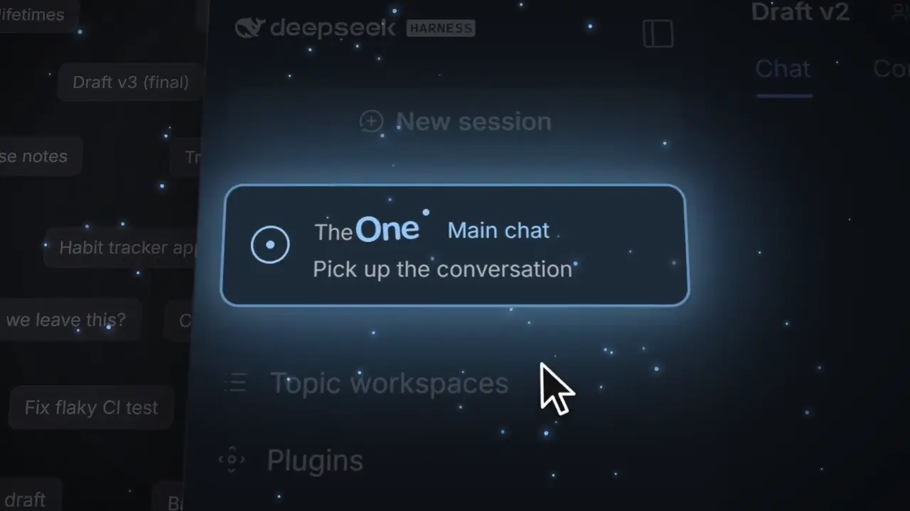

<h1 align="center">TheOne</h1>

<p align="center"><b>One chat for everything you're working on.</b><br>It knows which project each message belongs to, and keeps every project's context separate.</p>

<p align="center">
  
  
  
</p>

<p align="center">English | <a href="./README.zh.md">简体中文</a></p>

<p align="center"></p>

---

How many sessions are sitting in your DSH sidebar? Getting back to last week's work means digging through them. Skip creating a new one and everything piles into a single session, where topics bleed into each other and the details vanish at the next compaction.

**TheOne takes care of that.** You just talk in one main chat:

<picture>
  <source media="(prefers-color-scheme: dark)" srcset="https://raw.githubusercontent.com/YunongDai2005/dsh-theone/main/docs/images/theone-architecture-en-dark.svg">
  
</picture>

Each project gets its own background session that reasons, runs tools and compacts on its own. What you see is always one ordinary conversation.

## Why try it

| | Usual workflow | With TheOne |
| --- | --- | --- |
| Start something new | Create a session, name it | Just say it |
| Go back to earlier work | Dig through the sidebar | Mention it; TheOne finds it |
| One session gets cluttered | Topics interfere; compaction drops details | Every project has its own context |
| Two projects need each other | Copy and paste | The other project's progress comes along |
| Wrong project | Move it by hand | Say "wrong topic" |

- **Feels native.** Thinking streams in its usual place from the first token, and tool cards, approvals, questions, todo lists, retries and mid-reply steering all work as usual.
- **Related work connects; unrelated work stays out.** Related topics share progress automatically and TheOne learns which ones belong together from how you use them. A topic's constraints (say, "budget figures stay out of the paper") are attached verbatim every time, so compaction never drops them.
- **Gets better with use.** Say "wrong topic" or click **Move to…** in the directory, and TheOne learns which terms tie that kind of message to the right topic (one small model call), so similar messages go there from then on. The directory shows how often routing was kept as is.
- **Knows each topic early.** After a topic's first reply, and once more when it is clearer, a short card (what it is, other names you use for it, the people, places and files involved, what is still open) is written in the background, so routing recognises the topic in your own words from the start. Routing also sees when each topic was last active; topics left alone longer than you usually come back to one (learned from your own use, 7 days until there is enough) are set aside: still reachable, just considered last. Nothing to set up and nothing shown.
- **Your old sessions become a topic directory.** After install it reads your existing sessions in the background, turns them into topics grouped into workspaces, and you pick up where you left off.
- **Nothing extra to configure.** No separate API key: routing and the background sessions use the model you chose in DSH. When TheOne is the selected model, a button with a layers icon appears beside the model menu: it shows which model does the routing and the work, and switches it.


## Install in 30 seconds

1. Configure an API in DSH and select a model that can chat.
2. Open **Plugins → Add plugin**, enter `dsh-theone` under *Package name or address*, and install.
3. Click **TheOne · Main chat** in the sidebar and start talking.

That's it. Works with DSH `0.2.0-rc.2` and Node.js 24; the interface follows DSH's language (English / Simplified Chinese).

<details>
<summary><b>New to DSH? A step-by-step walkthrough (about 3 minutes)</b></summary>

No coding needed:

1. **Make sure DSH itself can chat.** Add your model provider's API key (DeepSeek's, for example) in DSH's settings, open an ordinary chat and say "hi". If it answers, you're set. TheOne uses that same model; there is no other key to enter.
2. **Install TheOne.** Click **Plugins** in the sidebar, then **Add plugin**, and enter:

   ```
   dsh-theone
   ```

   Click install and wait for it to finish.
3. **Start.** A new **TheOne · Main chat** appears in the sidebar. Open it and just talk about whatever is on your plate: today's work, the weekend trip, the paper you're writing. No new chats to create, nothing to name.
4. **Updates.** When a new version is out, a download icon appears next to the TheOne entry. One click installs it, no restart.
5. **Changed your mind?** Uninstall it on the Plugins page. Your DSH chats are all still there; TheOne organises them and never deletes them.

**Small things you may run into**

- **"Too new" and it won't install:** DSH only installs versions published at least 24 hours ago. That's a safety rule, not an error. Wait a day, or enter the GitHub address `https://github.com/YunongDai2005/dsh-theone` instead, which installs right away.
- **No TheOne in the sidebar after installing:** restart DSH.
- **Will it cost a lot?** Each message adds one short classification call (no deep thinking, at most 2,048 output tokens), and "ok" or "go on" skips even that. After installing, TheOne also organises your existing chats into a topic directory in the background; with many chats that first pass uses some of your quota. You can turn **History catalog** off in the settings.
</details>

<details>
<summary><b>Command line and other sources</b></summary>

- npm: `dsh plugin --profile web add dsh-theone --ignore-scripts` (use `desktop` instead of `web` for the desktop app)
- GitHub (always the latest main): `dsh plugin --profile web add github:YunongDai2005/dsh-theone --ignore-scripts`

A new version from npm installs once it has been published for 24 hours; when an update is newer than that, the update button explains it and can exempt TheOne alone so it installs right away.
</details>

> Unofficial community project, maintained independently. It is not affiliated with or endorsed by DeepSeek.

## How well does it route?

Claims are cheap, so we built a public benchmark, **InterleaveBench**: one person pushing 3–5 things forward in the same chat at once (a trip, a budget, a paper, a training plan…), half in Chinese and half in English, 50 conversations and 2,466 messages, each labelled in advance with the thing it belongs to. We replayed them message by message through TheOne's own routing code with DeepSeek V4.1 Flash (dev split, 40 conversations; messages even a careful human could not attribute are not scored):

| Approach | Messages routed correctly |
| --- | --- |
| TheOne, topic list given up front | **91.6%** |
| TheOne, starting from nothing and creating topics as it goes (your first day) | **86.6%** |
| Keyword search (BM25), topic list given up front | 73.3% |
| No routing, everything in one chat | 44.5% |
| Keyword search, starting from nothing | 39.9% |
| A new topic for every message | 9.8% |

A few numbers worth knowing:

- **A message landing in another thing's topic**, the mistake that hurts context most: about 3.7% when starting from nothing.
- The main weakness today is **opening new topics too eagerly**: one thing ends up split over 2.1 topics on average. 0.3.21's topic cards go after exactly that.
- The whole run cost about one US dollar. Data, code and scoring live in [`eval/`](./eval/README.md); reproduce it, or try another model.

The conversations are model-written from a script and this version has no assistant replies, so it measures whether messages are routed right, not everything about how chatting feels.

## How it works

**Choosing a topic.** Each message is matched to the current topic, an earlier one, or a new one. By default the model you selected makes one short classification (thinking off, at most 2,048 tokens), with candidates recalled through DSH full-text search.

- With no credible match it starts a new topic instead of asking whether it is new. It only asks when you refer to an earlier chat it cannot find, or it truly cannot tell which one you mean.
- When one message draws on several topics, the one doing the work gets it and the others come along as reference.
- "ok" or "go on" continues the current topic without waiting for a decision, and so does a picture or file sent without words.
- If the classification call fails, rules decide, staying in the current topic when unsure. Rule-based routing (`THEONE_ROUTER_MODE=rules`) makes no model calls at all.

**Linking topics.** A background session starting work receives a reference briefing, and none when there is nothing new:

- right after a topic switch, the last few turns of main chat, so "use what we just said" carries over;
- what changed in related topics since it last heard: their latest compaction summary (dated) and the progress after it;
- each topic's constraints, verbatim, every time.

The briefing is marked as reference, not instructions. For details, the background session can use `theone_read_topic` and `theone_search_history`. Linking scope is **Learn automatically** (default), **Same workspace only** or **Off**. In the directory you can link or unlink topics and mark a topic **Do not share**; your choices always win.

**Topic directory.** Each topic card shows its latest progress and constraints. Under **Manage** you can rename, edit the summary and constraints, move to another workspace, merge, delete, or attach an existing DSH session as searchable history; **+ New topic** starts one by hand. **Recent topic routing** lists where each message went, why, with which model and how long it took. With a long history, the first pass takes some time and API quota; set `THEONE_HISTORY_CATALOG=false` to turn it off.

<details>
<summary><b>Settings</b></summary>

Right-click the TheOne button in the sidebar and choose **Settings**. Changes apply when saved; only the history catalog settings wait for a DSH restart.

| Setting | What it does |
| --- | --- |
| Topic notices | How main chat shows topic changes: hidden, one line only when the topic changes (default), or on every message with the reason |
| Linking scope | Learn automatically (default), same workspace only, or off |
| Share confirmed facts (experimental) | Off by default. Topics share only facts the user confirmed (a figure, a decision, where a file is), with version and source; a topic that used one is told when it changes or is withdrawn. Applies after a DSH restart |
| Record facts automatically (experimental) | Off by default. With shared facts on, one small model call after each turn records facts the topic session left out; only user-confirmed ones are shared |
| Model | Follow DSH (default) or pin the background model from any model configured in DSH; a pinned model takes precedence over main chat's selector |
| Routing | LLM decision (default) or rule-based |
| History catalog | On/off and rescan interval |
| Limits | Topic descriptor length; reply length per background step, thinking included |
| Manual catalog file | Optional JSON file of hand-written topics, imported when saved |

The database location and entry identifier switch TheOne to different data, so they are set only through environment variables: `THEONE_DATABASE_PATH` and `THEONE_GATEWAY_KEY`. Also optional: `THEONE_CONTEXTS_PATH` and `THEONE_WORKER_PROVIDER` / `THEONE_WORKER_MODEL` (set both).
</details>

<details>
<summary><b>Data and privacy</b></summary>

- DSH keeps the original conversations and tool results; TheOne keeps only its catalog, summaries, links and routing records in its own SQLite database (`$DSH_HOME/theone/contexts.db`, `~/.dsh/theone/` by default).
- Text sent to the router or written into briefings has API keys, passwords and similar secrets removed.
- A topic marked **Do not share** never appears in other topics' briefings, recent-chat excerpts or lookups.
- Notices from the author are read from `https://yulid.org/theone/notice.json` with a plain request that sends none of your data; turn them off in Settings.
- When main chat grows long, DSH compacts it through TheOne: frequently used topics keep longer summaries and their latest turns, rarely used ones keep a short status. This makes no model call.
- When a new version is out, a download icon appears on the right of the TheOne entry in the sidebar: one click installs it through DSH's plugin manager and reloads TheOne in place, without restarting DSH (a DSH without plugin hot reload applies it at the next restart). Your topics stay in the database.
</details>

<details>
<summary><b>Known limitations</b></summary>

- One request runs at a time; messages queued during a reply wait for it to finish.
- New topics write files under `~/.dsh/theone/gateway`; you cannot yet choose a project folder for a new topic.
- Main chat stores copies of tool calls, so its log grows with use; entry-log rotation is not implemented yet.
- The main chat is remembered per browser: another browser or the desktop app gets its own main chat, sharing the same topics. Only one DSH process should use a database at a time.
- Image output is not forwarded yet; there is no vector search; topics cannot be split yet.
- Main chat shows tool cards without running them because TheOne sits first in DSH's tool pipeline. If another plugin also places itself first, it may see these mirrored calls, but no tool runs twice.
</details>

<details>
<summary><b>Development</b></summary>

```sh
git clone https://github.com/YunongDai2005/dsh-theone.git
cd dsh-theone
npm ci --ignore-scripts
npm run typecheck
npm test
```

Tests use the real DSH runtime (AgentLoop, Session, SQLite, JSONL persistence, compaction) with a simulated model, and call no external API. `npm run pack:plugin` builds the install package; `npm run install:local` and `npm run start:local` run a separate DSH profile in `~/.dsh-theone`.

Service API: `ctx.theone.searchHistoryDetailed(contextId, query, limit)` searches a topic's reviewed history; `store.addSource(contextId, sessionId, { startSeq, endSeq })` attaches part of a session. Earlier acceptance records: [v0.1](./docs/plugin-v0.1.md) and [v0.2](./docs/plugin-v0.2.md).
</details>


<details>
<summary>🥚</summary>

<br>

Congratulations, you found the easter egg.

In the benchmark, TheOne once made a very human mistake. The user said "the café's autumn menu was due on September 25, let's push it to October 8", and TheOne filed it under the October holiday trip to Yunnan. Both were in October, after all.

We're still training it; 0.3.21's topic cards came out of moments like this. If it ever files something of yours in the wrong place, just say "wrong topic" in the main chat. It will remember, and it won't take it personally.

</details>

---

<p align="center">If TheOne helps, a ⭐ helps others find it. Questions or ideas? <a href="https://github.com/YunongDai2005/dsh-theone/issues">Open an issue</a>.</p>
